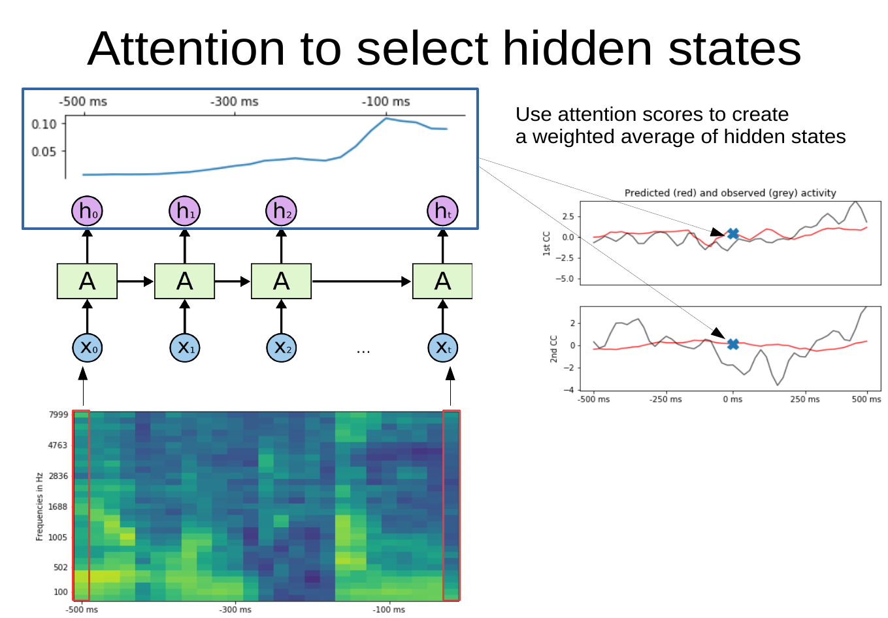
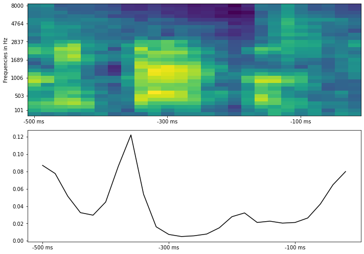
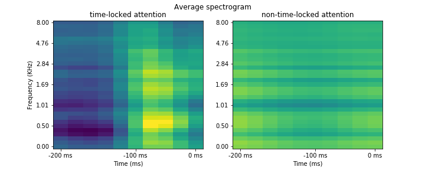

# Deep auditory encoding model with self-attention to predict brain activity


[](https://codecov.io/gh/mjboos/selfattention_audio)

Do you like deep learning-based auditory encoding models?
Always wanted to train a deep recurrent model to predict brain activity from an auditory stimulus (i.e. spectrogram) but vanilla GRU/LSTM/RNN immediately overfit?
Are you also interested in gaining some *interpretability* of whatever is learned by such a model in terms of the parts of the spectrogram that matter for predicting?

This library allows you to train a recurrent DNN (a GRU) and then learns a self-attention mechanism that weighs hidden states - the resulting weighted tensor is used to predict brain activity (or whatever you choose as a target).
It also contains many variations of this model type (CNN + GRU + attention, shared attention between targets, multi-head attention etc) and some functions for visualizing the computed attention weights on a spectrogram.

The general idea is captured in this figure:




We start with a spectrogram (bottom image) of an auditory stimulus and want to predict a given time point in the neural signal (right image, the time point is marked with a cross). In this case, we want to use the spectrogram of the past 500ms of the auditory stimulus (the spectrogram extends from -500 ms to 0 ms) to predict the current time point in the neural signal (the cross is located at 0 ms).

As a first step a [Recurrent Neural Network](https://en.wikipedia.org/wiki/Recurrent_neural_network) model processes a sequence of spectrogram "slices" (each `x` in the schematic) and produces hidden states for each time step (`h` in the schematic). Via self attention, each hidden state is assigned a weight (shown in the blue box with the attention scores as a line at the top). This allows us to create a weighted average of hidden states where the result is more strongly influenced by states with higher attention scores. Finally, this weighted average of hidden states is used to predict brain activity at the current time point (marked by the cross).

Trained on a sufficiently large audio/brain dataset (I didn't explore the lower limit), it gives some interesting results - essentially uncovering that to predict brain activity from audio data well, we need some time invariance and "pay attention" (pun intended) to certain parts of the spectrogram (somewhat) independently from *when* they appear.

## How to install

It's easiest to install this library via poetry - because there are dependencies on now ancient libraries (ancient in deep learning time, this was created late 2019).
Install poetry on your machine, clone this repository and execute:
```
poetry install
poetry run poe autoinstall-torch-cuda
```

You can of course also install this via pip:
* make sure your kernel/pipenv is on Python 3.7 (due to old torch version)
* clone the repository
* run `pip install -e .`

## An example analysis

This analysis can also be found in `fit_model_example.py` (except that we also extract animated attention plots).
```python
import numpy as np
import torch
from selfattention_audio import dataset_helpers as dhelp
from selfattention_audio import nn_helpers as nnhelp
from selfattention_audio import lightning_modules as light
from pytorch_lightning import Trainer
from selfattention_audio import extract_features_helper as ext
import matplotlib.pyplot as plt

from fit_model_example import plot_attention_with_specgram, create_lightning_model
```

We can now train a simple example model, a [Gated Recurrent Unit](https://en.wikipedia.org/wiki/Gated_recurrent_unit) with attention applied to the hidden states of the last layer - this compresses all hidden states into one, which can be used to predict whatever brain activity one has recorded.

As we will see later, one nice use of the attention weights is that they assign an importance to each part of the spectrogram, we thus gain some interpretability compared to other deep models.


```python
from pytorch_lightning.callbacks import ModelCheckpoint
import joblib

# example data is a dictionary of features (spectrograms) and targets (a 2D brain representation)
example_data = joblib.load("./tests/example_data.pkl")
train_data, test_data, val_data = [
    dhelp.AudioBrainDataset(
        example_data[f"features_{split}"],
        example_data[f"targets_{split}"],
        transform=None,
    )
    for split in ["train", "test", "val"]
]
model_params = dict(
    hidden_size=150,
    num_layers=2,
    n_patterns=30,
    n_window=5,
    n_targets=2,
    dropout=0.2,
)

nn_model = nnhelp.GRU_with_attention(**model_params)

# a lightning model is a convenient object that contains train, val, and test data loaders
# and information about the optimizer to use
model = create_lightning_model(train_data, test_data, val_data, nn_model=nn_model)


checkpoint_callback = ModelCheckpoint(
    filepath="./saved_models/example_model_gru_single_head_attention",
    verbose=True,
    monitor="val_loss",
    mode="min",
    prefix="gru_single_head_attention",
)

# we now train the model until there was no improvement anymore (max 100 epochs)
trainer = Trainer(max_nb_epochs=100, checkpoint_callback=checkpoint_callback)
trainer.fit(model)

# for each attention model there's also an "Extract" model
# this class returns attention scores instead of targets in the forward pass
gru_att_extractor = create_lightning_model(
    train_data,
    test_data,
    val_data,
    nn_model=ext.ExtractGRU_with_attention(**model_params),
)
# we load the state dict of the trained model into the extractor
gru_att_extractor.load_state_dict(model.state_dict())
# and extract attention weights for each sample in the test dataset
attention = np.squeeze(
    gru_att_extractor.model(torch.tensor(test_data.features)).detach().numpy()
)

# here we show the attention scores for a single data point (i.e. over a spectrogram)
sample_to_plot = 200
_ = plot_attention_with_specgram(
    attention[sample_to_plot], test_data.features[sample_to_plot]
)

```



The resulting plot shows the attention weights that were computed for each part (hidden state) of the spectrogram.
When trained for long enough and with more data, the attention weights "latch on" to changes in the spectrogram, such as start and end of words or syllables.
If the data in your test features are contiguous in time, one nice visualization shows attention while the stimulus (spectrogram) develops across time.


```python
def make_video_for_samples(attentions, features, vmin=None, vmax=None, interval=30):
    """Creates an animation for showing how attention develops over the features

    Attentions need to be a (sample, time_steps) array
    Features a (samples, time_steps, frequencies) array"""
    from matplotlib.animation import FuncAnimation
    import os
    vmin = features.min() if vmin is None else vmin
    vmax = features.max() if vmax is None else vmax
    att_max = attention.max()
    fig = plot_attention_with_specgram(attentions[0], features[0], vmin=vmin, vmax=vmax, att_max=att_max)
    im = fig.axes[0].images[0]
    line = fig.axes[1].get_children()[0]
    idx, _ = line.get_data()
    def animate_func(i):
        im.set_array(features[i+1].T)
        line.set_data(idx, attentions[i+1])

    # create animation using the animate() function
    myAnimation = FuncAnimation(fig, animate_func, frames=np.arange(features.shape[0]-1), \
                                          interval=50, blit=False, repeat=True)
    return myAnimation
```


```python
%matplotlib notebook
anim = make_video_for_samples(attention[170:270], test_data.features[170:270])
```

## What could this look like in your data?

Now this was trained on some very small example data, so what happens if we train this model on a larger amount of data?

This is an example of what results from actual audio/brain data can look like (brain activity is compressed in only 2 dimensions for visualization):


This plot is similar to the first figure in that we try to predict brain activity (represented by two canonical components) at each time point by the spectrogram of the auditory stimulus that preseded this time point by up to 500 ms (and the attention scores across the hidden states of the spectrogram).
To show how this develops across time, we slide the time point to predict (and thus also the spectrogram up to 500 ms before that time point) *forward* in time and can observe how the attention scores change (in this case we use two parallel attention layers). Usually they track the last hidden states but for some auditory features they "latch on" to them.

A very simple heuristic to know what the model "pays attention to" is to identify parts of the stimulus to which attention is time-locked (e.g. attention assigns high weights even if this stimulus part is in the past) and compare it to parts of the stimulus that attention does not time-lock on:



In this case, the auditory features that the attention model latches onto are onsets of sounds located roughly 100 ms before the neural signal; in other words, the model learns to attend to hidden states that coincide with sound onsets.
Naturally, your results will differ (this is just a simplified example).

## How to load your data

The easiest way to adapt this analysis to your data is to just initialize `dataset_helpers.AudioBrainDataset` with your own preprocessed data and feed it into `lightning_modules.AuditoryEncodingLightning`.

As with all such analyses, you should "lag" your data, e.g. for each sample of the data, create a matrix of spectrogram features from *t* - X to *t* to predict brain activity at time *t* (where X will be your window length). In contrast to standard linear encoding models, we will not flatten this spectrogram across time/frequencies, but keep it as a *T X F* matrix (where *T* are your time steps and *F* your frequencies).
Take a look at the docstring to figure out what to reshape in which way.
